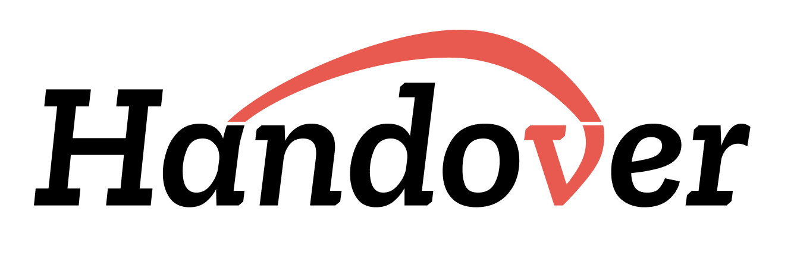
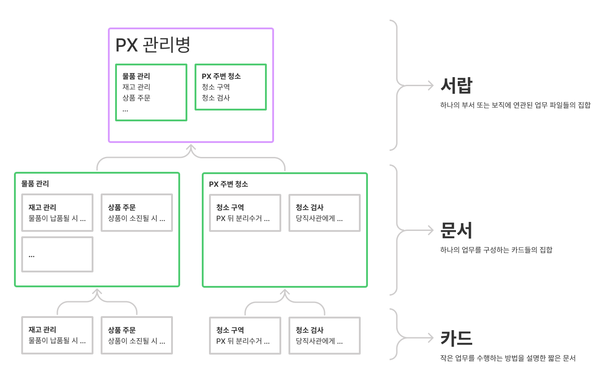
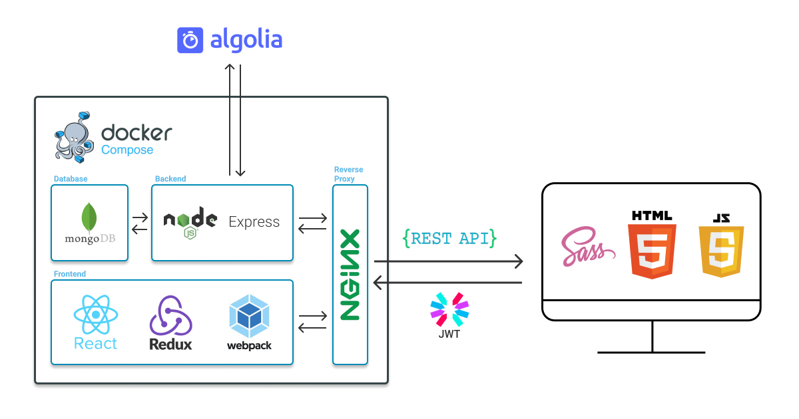

# 📋 Handover - 국방업무공유체계 
<p align="center">
 <br>
 
</p>
<p align="center">
 <a href="https://www.notion.so/osam-handover/f9e9132e0b0c4832a3d77e27411241e0?v=fe68ef0118be4d11aa0b1d0f6e8c20ea">Documentation</a>&nbsp;&nbsp;|&nbsp;&nbsp;<a href="">PPT</a>&nbsp;&nbsp;|&nbsp;&nbsp;<a href="">Demo Video</a>
</p>
<p align="center">
 
 
 
 
</p>

## 👋 프로젝트 소개 (Project Introduction)

 **Handover**는 군 내의 인수인계를 효율적이고 편리하게 진행할 수 있도록 돕는 Web 서비스입니다.

> **Handover**는 보직 변경 등의 상황에서 효율적이고 정확하지 않은 인수인계로 인해<br>
> **새로운 업무 환경에 적응**하는 것에 어려움을 겪거나 **업무의 공백**이 생기는 문제점을 해결하고자 합니다.<br><br>
> 더 나아가, 부대 간 효율적인 업무 방법을 공유하는 **통합적 업무 공유 플랫폼**을 제공하는 것을 목표로 하고 있습니다.<br>


## 📖 목차
<ol>
 <li><a href="#features">기능 설명</a></li>
 <li><a href="#prerequisites">컴퓨터 구성 / 필수 조건 안내</a></li>
 <li><a href="#stacks">기술 스택</a></li>
 <li><a href="#expectation">기대 효과</a></li>
 <li><a href="#competitiveness">경쟁력</a></li>
 <li><a href="#install">설치 안내</a></li>
 <li><a href="#gettingstarted">프로젝트 사용법</a></li>
 <li><a href="#structure">소스코드 구조</a></li>
 <li><a href="#teaminfo">팀 정보</a></li>
 <li><a href="#license">저작권 및 사용권 정보</a></li>
</ol>

<h2 id="features"> ✨ 기능 설명 (Key Features) </h2>

Handover만의 **3가지 핵심 기능**과 함께 더 편리하고 똑똑한 인수인계를 진행해보세요!
 - **3단계 문서 구성** 으로 **체계적인** 인수인계 문서
 - **그룹**, **북마크**, **댓글** 기능들로 **공유하는** 인수인계 문서
 - **보안 관리자** 기능으로 보안위반으로부터 **안전한** 인수인계 문서

<h3> 🗄️ 3단계 문서 구성 </h3>

<p align="center">
 
</p>

Handover 내의 모든 문서는 **🗄️서랍, 📰문서, 📇카드** 의 3단계 구성을 갖습니다.
- **서랍**: 부서 또는 보직에 연관된 **문서들의 집합**
- **문서**: 하나의 업무를 구성하는 **카드들의 집합**
- **카드**: 작은 업무를 수행하는 방법을 설명한 **짧은 글**

3단계 문서 구성과 **문서 작성 가이드**를 통해 더 읽기 쉽고, 체계화된 문서를 작성해보세요!

<h3> 🤝 문서 공유 서비스 </h3>

<p align="center"> 
 
</p>

- 같은 보직, 같은 소속의 사용자들과 인수인계 문서를 **공유**하고, **댓글**을 통해 의견을 나누어보세요!
- 마음에 드는 문서가 있다면, **북마크** 기능을 통해 언제든지 문서를 다시 열람할 수 있습니다.

<h3> 🔐 보안 관리자 등록을 통한 기밀 유출 방지 </h3>

<p align="center"> 
 
</p>

- 그룹 별로 **보안 관리자**를 등록해 그룹 내 문서에서 보안 사항이 위반되고 있는지 확인하고, 관리할 수 있습니다.

<h2 id="prerequisites"> 🔎 컴퓨터 구성 / 필수 조건 안내 (Prerequisites) </h2>

|<image src="./image/Chrome.png" width="20" height="20"> Chrome|<image src="./image/Edge.png" width="20" height="20"> Edge|<image src="./image/Firefox.png" width="20" height="20"> FireFox|<image src="./image/Safari.png" width="20" height="20"> Safari|
|:---:|:---:|:---:|:---:|
|✔|✔|✔|✔|
 
<h2 id="expectation"> ✨ Handover 기대효과 (Expectation) </h2>
 
 ### 👍 인수인계 방식의 체계화
  - 공통된 인수인계 문서 작성 플랫폼을 통한 **인수인계 방식 통일**
  - 3단계 문서 구성을 통한 인수인계의 효율성 및 정확도 향상
  - 인수인계 방식의 개선으로 군 장병의 **업무 적응기간 단축** 기대
 
 ### 🤝 부대 간 정보 공유 확대
  - 업무 문서를 공유해 **부대 간 소통** 확대
  - 사용자들의 **의견 공유**를 통한 업무 효율성 상승
  - **노하우 공유**를 통한 업무 능률 증폭
 
<h2 id="competitiveness"> 🔥 Handover가 가진 경쟁력 (Competitiveness) </h2>
 
 ### 📊 인수인계 문서의 데이터화
  - 사용자들의 업무 수행 문서들을 국방과학연구소, 국방정책실 등의 기관에서 연구데이터로 활용 가능
  - **실무에서의 업무처리 방식 및 문제점**을 확인하고 개선하여 군 전체의 발전 기대
 
 ### 📖 오픈소스로써의 Handover
  - **API Doc, Database Schema를 제공**함으로써 오픈소스 개발자들의 지속적 개발 지원
  - Editor내 표 작성, 수식 작성 기능 등 **사용자들이 필요로 하는 기능**들을 추가하며 성장 가능
 
<h2 id="stacks"> 🛠️ 기술 스택 (Key Tech Stacks) </h2>
  
 
 ### 🚉 Platform
  - [docker](https://www.docker.com/)
  - [docker-compose](https://docs.docker.com/compose/)
  - [nginx](https://www.nginx.com/)

 ### :shopping_cart: Back-end
  - [Node.js](https://nodejs.org/en/)
  - [Express](https://expressjs.com/)
  - [jsonwebtoken](https://github.com/auth0/node-jsonwebtoken)
  - [MongoDB](https://www.mongodb.com/)
  - [Mongoose](https://mongoosejs.com/)
  - [Algolia](https://www.algolia.com/)
 
 ### 💄 Front-end
  - [React](https://reactjs.org/)
  - [Redux](https://redux.js.org/)
  - [MaterialUI](https://mui.com/)
  - [Sass](https://sass-lang.com/)
  - [webpack](https://webpack.kr/)
 
<h2 id="install"> 🚀 설치 안내 (Installaltion Methods) </h2>

### 1. Clone Repository
```
git clone https://github.com/osamhack2021/Web_Handover_Handover.git handover
```
### 2. Docker 설정
사용 운영체제에 맞는 Docker 설치 => [`Get Docker`](https://docs.docker.com/get-docker/)
### 3. Docker 실행
```
npm run prd
```
### 4. Docker 중지
```
npm down
```


<h2 id="gettingstarted"> 🏃 프로젝트 사용법 (Getting Started) </h2>

- yet to do...
 
<h2 id="structure"> 🕹️ 소스코드 구조 (Source Code Structure) </h2>

* Environment
    - `/`
* WEB(FE)
    - `/frontend`
* WEB(BE)
    - `/backend`
 
<h2 id="teaminfo"> 👨‍👦‍👦 팀 정보 (Team Info) </h2>

<table width="788">
    <thead>
    <tr>
        <th width="100" align="center">사진</th>
        <th width="100" align="center">이름</th>
        <th width="150" align="left">역할</th>
        <th width="100" align="center">GitHub</th>
        <th width="175" align="center">이메일</th>
    </tr> 
    </thead>
    <tbody>
    <tr>
        <td width="100" align="center">
            <a href="https://github.com/ntcho">
                
            </a>
        </td>
        <td width="100" align="center">조나단</td>
        <td width="150">
            팀장<br>
            프론트엔드 개발
        </td>
        <td width="100" align="center">
            <a href="https://github.com/ntcho">
                
            </a>
        </td>
        <td width="175" align="center">
            <a href="mailto:ntcho13@gmail.com">
                
            </a>
        </td>
    </tr>
    <tr>
        <td width="100" align="center">
            <a href="https://github.com/ahnavocado">
                
            </a>
        </td>
        <td width="100" align="center">안수겸</td>
        <td width="150">
            디자인<br>
            프론트엔드 개발
        </td>
        <td width="100" align="center">
            <a href="https://github.com/ahnavocado">
                
            </a>
        </td>
        <td width="175" align="center">
            <a href="mailto:ahn.avocado@gmail.com">
                
            </a>
        </td>
    </tr>
    <tr>
        <td width="100" align="center">
            <a href="https://github.com/holymollyhao">
                
            </a>
        </td>
        <td width="100" align="center">김태원</td>
        <td width="150">
            프론트엔드 개발
        </td>
        <td width="100" align="center">
            <a href="https://github.com/holymollyhao">
                
            </a>
        </td>
        <td width="175" align="center">
            <a href="mailto:maxkim139@gmail.com">
                
            </a>
        </td>
    </tr>
    <tr>
        <td width="100" align="center">
            <a href="https://github.com/cw00h">
                
            </a>
        </td>
        <td width="100" align="center">최우혁</td>
        <td width="150">
            프론트엔드 개발
        </td>
        <td width="100" align="center">
            <a href="https://github.com/cw00h">
                
            </a>
        </td>
        <td width="175" align="center">
            <a href="mailto:cwooh8@gmail.com">
                
            </a>
        </td>
    </tr>
    <tr>
       <td width="100" align="center">
            <a href="https://github.com/phjppo0918">
                
            </a>
        </td>
        <td width="100" align="center">박현준</td>
        <td width="150">
            백엔드 개발
        </td>
        <td width="100" align="center">
            <a href="https://github.com/phjppo0918">
                
            </a>
        </td>
        <td width="175" align="center">
            <a href="mailto:phjppo0918@gmail.com">
                
            </a>
        </td>
    </tr>
    <tr>
        <td width="100" align="center">
            <a href="https://github.com/134130">
                
            </a>
        </td>
        <td width="100" align="center">오지환</td>
        <td width="150">
            백엔드 개발
        </td>
        <td width="100" align="center">
            <a href="https://github.com/134130">
                
            </a>
        </td>
        <td width="175" align="center">
            <a href="mailto:sapindus_hwan@naver.com">
                
            </a>
        </td>
    </tr>
    </tbody>
</table>

<h2 id="license"> 📝 저작권 및 사용권 정보 (Copyleft / End User License) </h2>
 
  - [**MIT License**](https://opensource.org/licenses/MIT)
 
